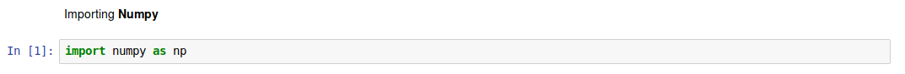
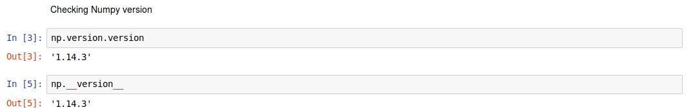
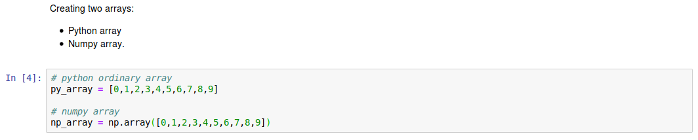
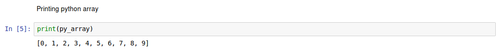
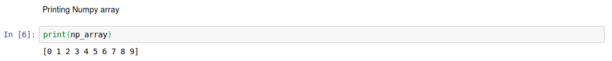

# Intorduction

**Numpy** is a math library for python, short for **Numerical Python**, is the fundamental package required for high performance scientific computing and data analysis in Python. It enables us to do computation efficiently and effectively. It is better than regular python because of it’s amazing capabilities. It is the foundation on which nearly all of the higher-level tools such as **Pandas** and **scikit-learn** are built. **TensorFlow** uses NumPy arrays as the fundamental building block on top of which they built their Tensor objects and graphflow for deep learning tasks.

## History of Numpy

The ancestor of NumPy, Numeric, was originally created by **Jim Hugunin** with contributions from several other developers. In _2005_, **Travis Oliphant** created NumPy by incorporating features of the competing Numarray into Numeric, with extensive modifications. NumPy is open-source software and has many contributors.

## Why to use Numpy

There some reasons might pushes you to use numpy.

* `ndarray`, a fast and space-efficient multi-dimensional array providing vectorized arithmetic operations and sophisticated broadcasting capabilities.
* Standard mathematical functions for fast operations on entire arrays of data without having to write loops.
* Numpy provides C implementation of it's standard functions, avoiding the general cost of loops in Python, pointer indirection and per-element dynamic type checking. The speed boost depends on which operations you’re performing.
* Numpy allows vectorization which it easier to make operations on vectors and matrices without loops and in less lines of code.

## Some facts about Numpy

At the core of the NumPy package, is the `ndarray` object. This encapsulates n-dimensional arrays of homogeneous data types, with many operations being performed in compiled code for performance. There are several important differences between NumPy arrays and the standard Python sequences:

* NumPy arrays have a **fixed** size at creation, unlike Python lists (which can grow dynamically). Changing the size of an ndarray will **create** a new array and **delete** the original.
* The elements in a NumPy array are all required to be of the **same data type**, and thus will be the **same size** in memory.
    > The exception: one can have arrays of (Python, including NumPy) objects, thereby allowing for arrays of different sized elements.
* NumPy arrays facilitate advanced mathematical and other types of operations on large numbers of data. Typically, such operations are executed more efficiently and with less code than is possible using Python’s built-in sequences.

## Installing Numpy

### Installing via `pip`

> Most major projects upload official packages to the Python Package index. They can be installed on most operating systems using Python’s standard pip package manager. _Note that you need to have Python and pip already installed on your system._ You can install packages via commands such as:

`python -m pip install --user numpy`

### Install system-wide via a Linux package manager

> Users on Linux can install packages from repositories provided by the distributions. These installations will be system-wide, and may have older package versions than those available using pip.

* Ubuntu & Debian

    `sudo apt-get install python-numpy`
* Fedora: _22 or later_

    `sudo dnf install numpy`
* Install via Anaconda
    > numpy and many other package come with anaconda as default environment of data analysis.

    `conda install -c anaconda numpy`

## Using Numpy

The first thing I want to introduce you to is the way you import it.

**Note:** most of numpy user using `np` convension for development ease.

After that I want you to check the numpy version, there is two ways to check the numpy package version.

Now, let us create two _arrays_, one using python array and the other using numpy `ndarray`

After creating the _two arrays_ let us go and print them to see if there is any difference between them.

As you see there is no difference so far between the _numpy arrays_ and _python arrays_.

### `np.arrange()`
